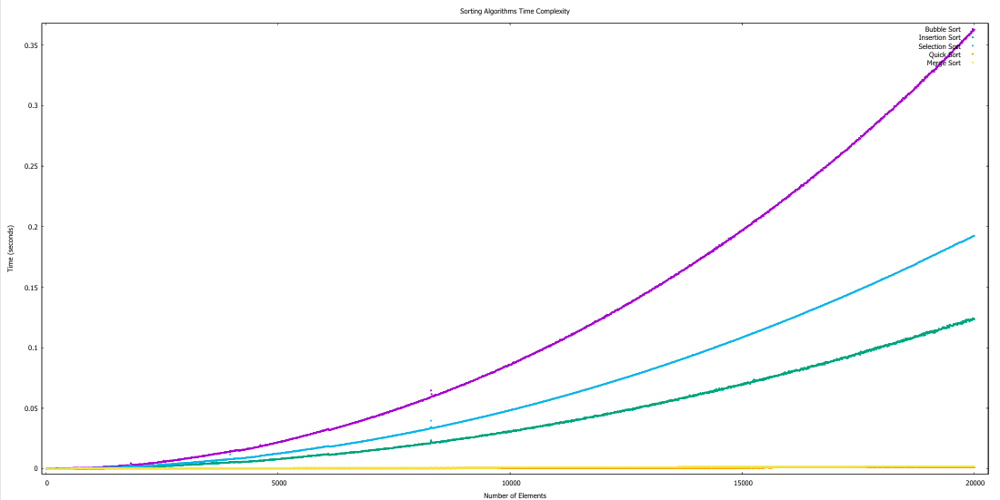
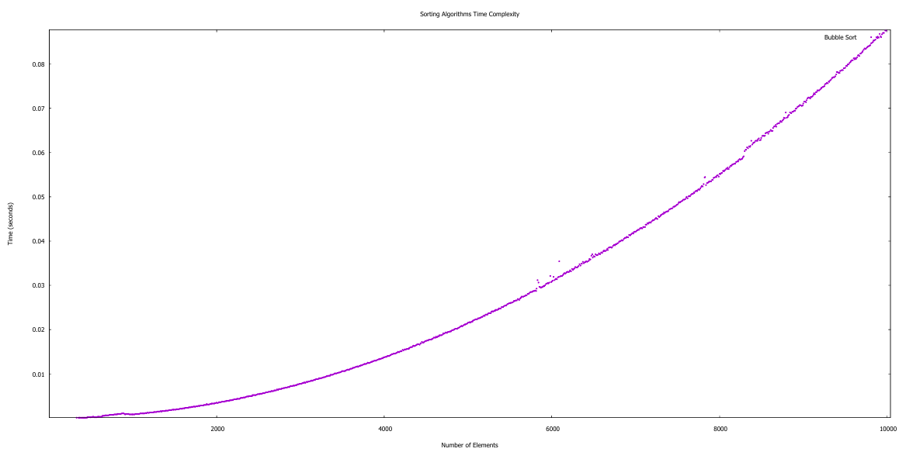
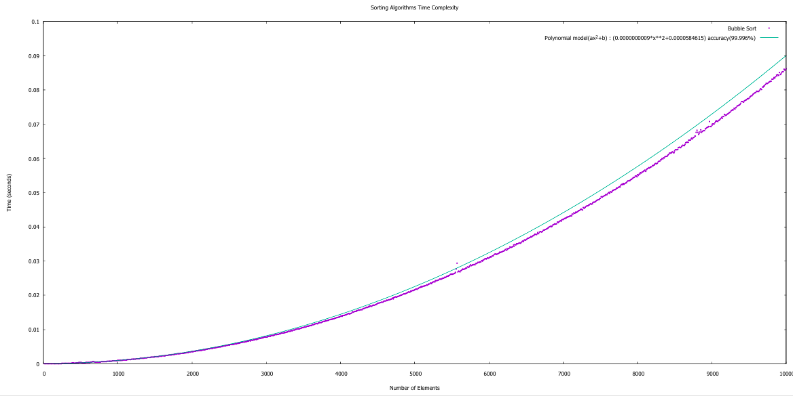
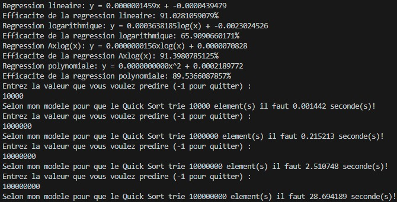

# C-Based Sorting Algorithms with Regression Analysis

A comprehensive toolkit for analyzing sorting algorithm performance and predicting execution times through various regression models.

## Getting Started

### Required:
- GCC or compatible C compiler

### Build & Run Instructions

#### Compilation
```bash
gcc -o app.exe main.c
```

#### Execution
##### Windows:
```bash
./main.exe
```
##### Linux:
```bash
main.exe
```
### Sorting Algorithm Analysis
- Compare the performance characteristics of multiple sorting algorithms with customizable dataset sizes.
Analyze all algorithms:
```bash
main.exe -algorithm all -size 10/10000/10
```


```bash
main.exe -algorithm all -size 10/10000/10
```
#### Focus on a specific algorithm:
```bash
main.exe -algorithm bubblesort -size 10/10000/10
```

### Regression Analysis

This project includes a **linear regression** module that uses mathematical formulas to analyze data through four different models:

1. **Linear Model**: Direct proportional relationship between input and output.
2. **Logarithmic Model**: Output increases logarithmically with input.
3. **Log-Linear Model**: Linear relationship in logarithmic scale.
4. **Quadratic Model**: Curvilinear relationship where output is a quadratic function of input.

#### How It Works

The program computes each model using their respective mathematical formulas and compares the accuracy of each by evaluating the residuals (errors) between predicted and actual values. At the end of the analysis, the program identifies the model that best fits the data based on these error comparisons, giving you the most suitable regression type for your dataset.
#### Conclusion:

The system automatically determines the most accurate model by comparing prediction errors (residuals) against actual performance data.

#### Generate regression analysis with prediction:
```bash
main.exe -algorithm bubblesort -size 10/10000/10 predict 1
```
#### Representation of the bubble sort algorithm and the best model that fit with it


### Performance Prediction

#### How It Works

At the end of the program, if you activate the prediction option by entering `[predict -1]`, you will interact with the console. The program will prompt you to specify the number of elements you wish to predict. Using the formula from the best-fitting model, it will then provide an estimate of the execution time for the predictions.

#### Prediction

Activate the prediction module to estimate execution times for arbitrary dataset sizes.

Prediction workflow:
1. Run with the predict flag
2. Enter the desired number of elements when prompted
3. Receive execution time estimates based on the optimal regression model

### Exemple of console communication to predict the time of execution :


## Help & Documentation
Access comprehensive documentation directly from the command line:

 `main.exe -help` 

This displays all available options and detailed usage instructions to help you maximize the toolkit's capabilities.
